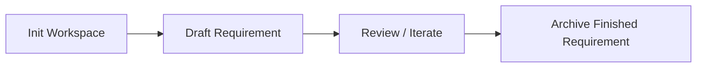

<div align="center">

# Docscode

**Open-source Codex Skills for Chinese requirements workflows**

[](./LICENSE)
[](https://github.com/ikunycj/docscode)
[](https://github.com/ikunycj/docscode/commits/master)

面向 `docs/requirements/` 工作流的开源 Skills 仓库。  
把需求初始化、需求撰写、需求归档，做成可以安装、复用、迭代的 Skill。

</div>

---

## Overview

`Docscode` 不是一组零散提示词，而是一套围绕需求文档生命周期设计的 Skills：

- 初始化文档工作区
- 把模糊需求整理成 `require.md` / `test.md`
- 将已完成或废弃的 requirement 目录安全归档

它适合这类场景：

- 你希望 AI 输出更像真实团队里的需求文档，而不是泛化 PRD
- 你希望把文档流程沉淀为可安装、可评审、可版本化的 Skill
- 你希望在 GitHub 上公开维护自己的 Skills，而不是只在本地使用

## Why This Project

- **围绕真实目录结构设计**：直接服务于 `docs/requirements/`、`require.md`、`test.md`
- **强调 guardrails**：减少“顺手改代码”“顺手改无关文档”这类越界行为
- **适合中文场景**：以中文需求分析、验收描述、测试设计为核心表达
- **可组合使用**：初始化、撰写、归档是三个独立 Skill，也是一条完整工作流
- **适合开源维护**：每个 Skill 都是独立发布单元，可通过 PR / Issue / Release 演进

## AI Coding Best Practices

这个仓库并不把 Skill 当成“几段 prompt”，而是把它放进一条更完整的 AI Coding 工作流里。

推荐组合方式：

- **OpenSpec**：把模糊需求拆成 `proposal`、`specs`、`design`、`tasks`
- **Codex CLI**：作为真正执行命令、落地实现、并发协作的入口
- **Docscode Skills**：负责把需求文档生命周期标准化，尤其是 `docs/requirements/` 这层文档工作

相关项目：

- [OpenSpec](https://github.com/Fission-AI/OpenSpec)

### Documentation-Oriented Programming

这套工作流的核心前提是：文档先于代码，文档约束代码。

在 AI Coding 场景里，Markdown 不只是说明文档，更像是一种高价值的“源代码”：

- `README.md` 解释项目定位
- `AGENTS.md` 告诉 AI 工具项目规则和边界
- `docs/PRD.md`、`docs/CURRENT.md`、`docs/ARCHITETUCTURE.md`、`docs/API.md` 提供长期上下文
- `docs/requirements/<requirement>/require.md` 和 `test.md` 则描述某次具体需求

推荐目录结构：

```text
README.md                     # 项目介绍
AGENTS.md                     # 给 AI 编程工具阅读的项目概览和约束
.codex/
  rules/                      # AI 规则、电子围栏、宏命令
docs/
  requirements/
    archive/                  # 已完成需求归档
    requirename-date/         # 某次具体需求
      require.md              # 需求描述
      test.md                 # 测试用例与验证说明
  PRD.md                      # 产品宏观描述，最终形态
  CURRENT.md                  # 当前产品状态
  ARCHITETUCTURE.md           # 系统架构
  API.md                      # 项目 API 文档
```

`Docscode` 的三个 Skills，本质上就是在帮助你维护这套文档结构，而不是绕过它。

### Test-Oriented Development

除了“面向文档”，另一条关键原则是“面向测试”。

推荐把 `test.md` 当成需求交付的一部分，而不是最后补的附件。  
在实现阶段，可以自然衔接到 TDD 的经典循环：

1. `Red`：先写一个会失败的测试
2. `Green`：写最少量代码让测试通过
3. `Refactor`：在测试保护下优化结构，不改变行为

这也是为什么 `docscode-create-require` 会强调 `require.md` 和 `test.md` 一起维护，而不是只写一份看起来完整的需求文档。

## Skill Catalog

| Skill | What it does | Typical use case |
| --- | --- | --- |
| `docscode-init-require` | 初始化 `docs/`、`docs/requirements/`、`archive/` 和 Markdown 骨架 | 仓库还没有 requirements 文档工作区 |
| `docscode-create-require` | 生成或更新 `require.md` 与 `test.md`，建立 `REQ / AC / TC` 追踪关系 | 只有简要需求，需要落成结构化文档 |
| `docscode-archive-require` | 将完成、废弃或不再维护的 requirement 目录移入 `archive/` | 功能已结束维护，需要关闭对应需求目录 |

## How The Workflow Fits Together



推荐的使用顺序：

1. 先用 `docscode-init-require` 建立文档骨架
2. 再用 `docscode-create-require` 产出 `require.md` 与 `test.md`
3. 需求完成或废弃后，用 `docscode-archive-require` 做归档

## Recommended End-to-End Workflow

如果你采用 `OpenSpec + Codex CLI + Docscode Skills` 这套组合，可以按下面的顺序工作：

1. 基于 `PRD`、`CURRENT`、`ARCHITETUCTURE`、`API`、`AGENTS` 生成某次需求的 `requirename-date/`
2. 使用 `docscode-create-require` 补齐并细化 `require.md` 与 `test.md`
3. 执行 OpenSpec 的 `opsx-propose`，生成 `proposal`、`spec`、`design`、`tasks`
4. 再执行 `opsx-apply` 落地代码，并依据 `test.md` 进行验证
5. 需求完成后，使用 `docscode-archive-require` 归档对应目录

对应关系可以理解为：

- `Docscode`：管理需求文档输入与归档
- `OpenSpec`：管理变更设计与任务拆分
- `Codex CLI`：管理实际实现与验证过程

## Quick Start

推荐通过 GitHub 仓库路径安装单个 Skill。

安装 `docscode-init-require`：

```bash
python install-skill-from-github.py \
  --repo ikunycj/docscode \
  --path skills/docscode-init-require \
  --ref master
```

安装 `docscode-create-require`：

```bash
python install-skill-from-github.py \
  --repo ikunycj/docscode \
  --path skills/docscode-create-require \
  --ref master
```

安装 `docscode-archive-require`：

```bash
python install-skill-from-github.py \
  --repo ikunycj/docscode \
  --path skills/docscode-archive-require \
  --ref master
```

也可以使用 GitHub URL：

```bash
python install-skill-from-github.py \
  --url https://github.com/ikunycj/docscode/tree/master/skills/docscode-create-require
```

建议：

- 想拿最新版本，使用 `master`
- 想要更稳定的依赖点，使用 release tag
- 安装后重启 Codex，让新 Skill 被正确加载

## Example Prompts

`docscode-init-require`

```text
Use $docscode-init-require to scaffold docs/requirements for this repository.
```

`docscode-create-require`

```text
Use $docscode-create-require to draft require.md and test.md for a new export feature under docs/requirements.
```

`docscode-archive-require`

```text
Use $docscode-archive-require to archive docs/requirements/user-export after the feature is retired.
```

## Where Docscode Fits

如果把整个 AI Coding 流程拆开看，`Docscode` 主要负责最前面的“需求输入质量”与最后面的“需求生命周期收尾”：

- 在编码前，把模糊想法沉淀成结构化需求
- 在实现中，为 OpenSpec 和代码实现提供稳定输入
- 在完成后，把历史需求有边界地归档，不污染进行中的工作区

它不替代 OpenSpec，也不替代代码实现型 Agent。  
它更像是整个流程里负责需求文档层的那一层基础设施。

## Design Principles

这些 Skills 不是为了“多写文档”，而是为了“少写错文档”。

核心原则：

- **只在允许的路径内工作**
- **区分事实、推断和待确认项**
- **require.md 与 test.md 必须一起维护**
- **归档是归档，不混入撰写或实现**
- **初始化是初始化，不顺手补全业务内容**

## Repository Layout

```text
skills/
  docscode-archive-require/
  docscode-create-require/
  docscode-init-require/
scripts/
  validate_skills.py
.github/workflows/
  validate-skills.yml
```

说明：

- `skills/<skill-name>/` 是实际发布单元
- `SKILL.md` 定义触发语义与工作流
- `agents/openai.yaml` 提供 UI 展示元数据
- `scripts/validate_skills.py` 用于仓库级结构校验

## Quality Checks

本仓库使用 GitHub Actions 做基础结构校验。

本地执行：

```bash
python scripts/validate_skills.py
```

当前会检查：

- 每个 Skill 是否存在 `SKILL.md`
- `SKILL.md` frontmatter 是否只包含 `name` 与 `description`
- Skill 名称是否为 hyphen-case，且与目录名一致
- 每个 Skill 是否存在 `agents/openai.yaml`

## Roadmap

- 增加更多面向 `docs/requirements/` 的 Skill
- 增加更细的 example / references 资源
- 打 tag 并提供稳定安装版本
- 完善 README、示例仓库和使用截图
- 补充更系统的 Skill 设计规范

## Contributing

欢迎贡献：

- 新的 requirements workflow Skills
- 现有 Skill 的触发词优化
- 更清晰的 guardrails 和输出边界
- 校验脚本、分发流程和 GitHub Actions 改进

提交前建议：

```bash
python scripts/validate_skills.py
```

并确保：

- Skill 目录结构完整
- `SKILL.md` 的触发描述准确
- 不把仓库级 README / CHANGELOG 塞进单个 Skill 目录
- 不让 Skill 越权修改 `docs/requirements` 之外的无关内容

## FAQ

### 这是提示词仓库，还是 Skill 仓库？

这是 Skill 仓库。核心交付物是 `skills/<skill-name>/SKILL.md`，而不是一段单次使用的 prompt。

### 适合什么项目？

适合希望在仓库内维护结构化需求文档的项目，尤其适合已经采用 `docs/requirements/` 目录约定的团队。

### 可以只安装一个 Skill 吗？

可以。每个 Skill 都可以独立安装和使用。

### 为什么强调 `require.md` 和 `test.md` 一起维护？

因为这个仓库的目标不是只写“看起来完整”的文档，而是维持需求、验收和测试之间的追踪关系。

## License

本项目使用 [MIT License](./LICENSE)。
